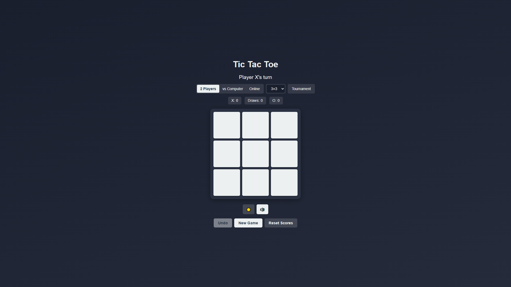
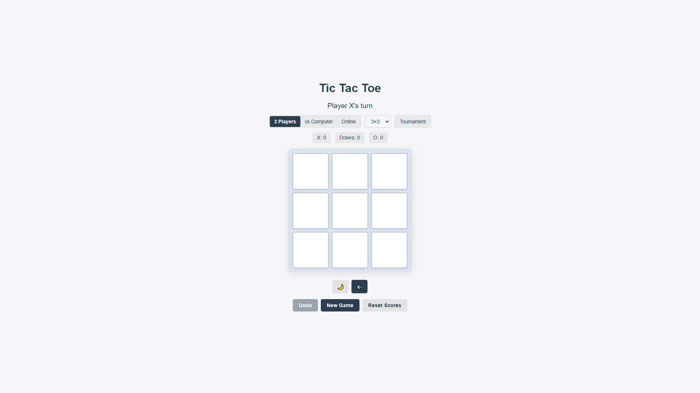
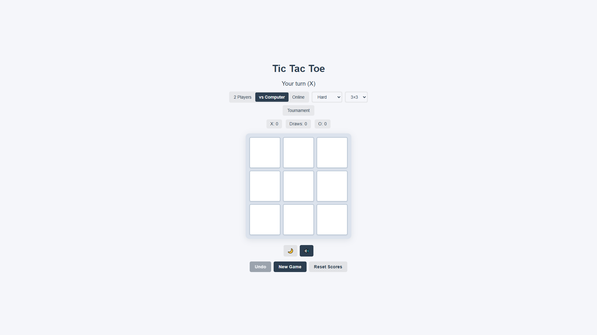
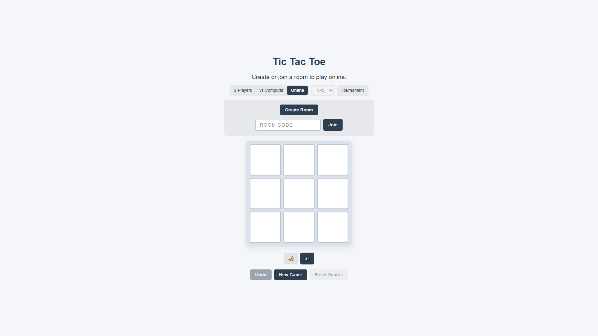
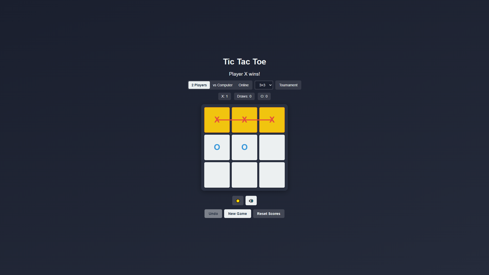

# Tic Tac Toe

A feature-rich Tic Tac Toe game built with vanilla HTML, CSS, and JavaScript. Play locally, against the computer, or online with a friend using Firebase Realtime Database.

**Live demo:** [tic-tac-toe-game-55f05.web.app](https://tic-tac-toe-game-55f05.web.app)

## Screenshots

| Dark theme (2 Players) | Light theme |
| :---: | :---: |
|  |  |

| vs Computer | Online lobby |
| :---: | :---: |
|  |  |

| Win state |
| :---: |
|  |

## Features

- **Game modes**
  - **2 Players** — pass-and-play on the same device
  - **vs Computer** — three difficulty levels (Easy, Medium, Hard)
  - **Online** — create or join a room with a 6-character code
- **Board sizes** — 3×3, 4×4, or 5×5
- **Tournament mode** — first to 3 series wins (best of 5)
- **Score tracking** — persistent X / O / Draw counts via `localStorage`
- **Undo** — take back moves in local games
- **Themes** — dark and light mode
- **Sound effects** — optional audio feedback with mute toggle
- **Win highlight** — animated line across the winning row, column, or diagonal

## Quick start

### Prerequisites

- [Node.js](https://nodejs.org/) (for the local dev server and Firebase CLI)

### Run locally

```bash
npm install
npm run serve
```

Open [http://localhost:3000](http://localhost:3000) in your browser.

Local **2 Players** and **vs Computer** modes work without any Firebase setup. Online multiplayer requires Firebase configuration (see below).

## Online multiplayer setup

1. Create a [Firebase project](https://console.firebase.google.com/) and enable **Realtime Database**.
2. Register a web app in Project settings and copy the config object.
3. Copy the example config and fill in your values:

   ```bash
   cp firebase-config.example.js firebase-config.js
   ```

4. Paste your Firebase web app config into `firebase-config.js`.
5. Deploy database rules and hosting (see [Deployment](#deployment)).

> **Important:** `firebase-config.js` is listed in `.gitignore` and must never be committed. Only `firebase-config.example.js` belongs in the repository.

Players create a room, share the code, and join from another browser or device. The host plays as **X**; the guest plays as **O**.

## Security

Firebase web API keys are included in client-side code when you deploy, but they should still be **restricted** and **never committed to Git**.

If GitHub secret scanning flagged your API key:

1. **Remove the config from Git** — this repo keeps secrets in local `firebase-config.js` only (see `.gitignore`).
2. **Rotate the exposed key** — in [Google Cloud Console](https://console.cloud.google.com/apis/credentials) → select the key → **Regenerate key**, or create a new Browser key and delete the old one. Update your local `firebase-config.js` with the new value.
3. **Restrict the new key** — under **Application restrictions**, choose **Websites** and allow only:
   - `http://localhost:3000/*`
   - `https://<your-project-id>.web.app/*`
   - `https://<your-project-id>.firebaseapp.com/*`
4. **Purge Git history** (public repos) — removing the file from the latest commit is not enough; the old key remains in history. Use [GitHub's secret scanning remediation](https://docs.github.com/en/code-security/secret-scanning/working-with-secret-scanning-and-push-protection/working-with-push-protection-from-the-command-line#resolving-a-blocked-push) or rewrite history with [git-filter-repo](https://github.com/newren/git-filter-repo).
5. **Harden Firebase** — keep Realtime Database rules tight (`database.rules.json`) and consider [Firebase App Check](https://firebase.google.com/docs/app-check) for production.

Local **2 Players** and **vs Computer** modes do not use the Firebase API key.

## Deployment

Deploy to Firebase Hosting and Realtime Database rules:

```bash
npm run deploy
```

On Windows, you can use the guided deploy script:

```powershell
.\deploy.ps1
```

The script checks Firebase login, validates project access, and deploys hosting plus database rules.

| Script | Description |
|--------|-------------|
| `npm run serve` | Local dev server on port 3000 |
| `npm run deploy` | Deploy hosting and database rules |
| `npm run deploy:hosting` | Deploy hosting only |
| `npm run deploy:rules` | Deploy database rules only |

After deployment, the app is available at:

- `https://<project-id>.web.app`
- `https://<project-id>.firebaseapp.com`

## Project structure

```
├── index.html              # App shell and controls
├── styles.css              # Layout, themes, and animations
├── game.js                 # Board logic, win detection, AI (minimax)
├── ui.js                   # DOM, game flow, scoreboard, themes
├── network.js              # Firebase room create/join/sync
├── firebase-config.js      # Your Firebase web app config (not in repo template)
├── firebase-config.example.js
├── firebase.json           # Hosting and database rules config
├── database.rules.json     # Realtime Database security rules
├── deploy.ps1              # Windows deploy helper
├── screenshots/            # README preview images
├── LICENSE                 # MIT License
└── package.json
```

## How it works

- **`game.js`** — Pure game engine: board state, win combinations for any grid size, and computer moves (random/heuristic on larger boards; minimax on 3×3 Hard).
- **`ui.js`** — Wires the UI to the engine, handles modes, tournament scoring, undo, themes, and sound.
- **`network.js`** — Syncs online games through Firebase Realtime Database under `/rooms/{code}`.

## License

This project is licensed under the [MIT License](LICENSE).

Copyright (c) 2026 Sakib

You are free to use, copy, modify, merge, publish, distribute, sublicense, and/or sell copies of this software, subject to the conditions in the license file.
